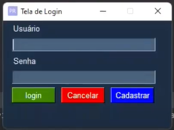
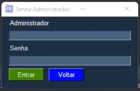
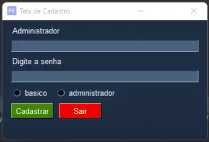

<h1 align="center">💻Sistema de Login</h1>
 
 
<!--## -->

### Tópicos 

- 🏷[Descrição](#descrição)

- 💻[Resultado](#resultado)

- 🗳[Link](#link)

- 📌[Licença](#licença)

- 👍[Autor](#autor)

## 🏷 Descrição 

Tela de Login criada com PySimpleGUi uma pacote de interface gráfica, onde foi desenvolvido a logíca de verificação de acesso e tipo de acesso

## 💻 Resultado

Função para validação de usuários

 
<pre>
<code>
def verificar_usuarios (login, senha, acesso):
    novousuario = []
    try:
        with open('Usuarios.txt', 'r+', encoding='utf-8', newline='') as arquivo:
                for lin in arquivo:
                    lin = lin.strip(",")
                    novousuario.append(lin.split())
                for usuario in novousuario:
                    nome = usuario[0]
                    novasenha = usuario[1]
                    tipoacesso = usuario[2]
                    if login == nome and acesso == tipoacesso and senha == novasenha:
                        return True

    except FileExistsError:
        return False
    arquivo.close()
</code>
</pre>
 

Tela inicial , autenticação com usuário e senha.

 
 

##
 

Tela login administrador , nessa tela apenas usuários com cadastro Administrador pode cadastrar novos usuários.

 
 

##

 

Tela de cadastro , Tela com acesso apenas para administradores ,nessa tela será possivel incluir novos usuários básicos ou administrador.

 
 

## 🗳 Link
 
 
Projeto <a href="https://github.com/Reginaldo-projects/Sistema_Login/blob/main/app.py" target="_blank">aqui</a>.

## 📌 Licença

 ---

## 👍 Autor

<table>
  <tr>
    <td align="center">
      <a href="https://github.com/Reginaldo-projects">
         
        
          <b>Reginaldo Barbosa</b>
        
      </a>
    </td>
  </tr>
</table>

 
